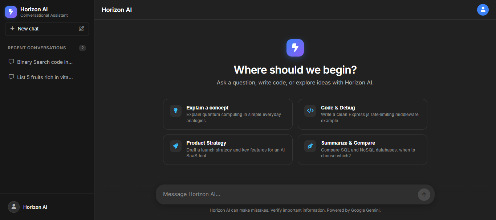
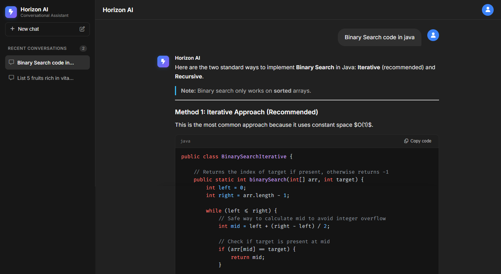

# ⚡ Horizon AI: Conversational AI Platform

[](https://react.dev/)
[](https://vite.dev/)
[](https://nodejs.org/)
[](https://expressjs.com/)
[](https://ai.google.dev/)
[](https://www.mongodb.com/atlas)
[](https://fontawesome.com/)
[](LICENSE)

**Horizon AI** is an enterprise-grade, full-stack conversational AI platform built with **React 19**, **Express 5**, **Node.js**, **MongoDB Atlas**, and powered by Google's next-generation **Gemini API** via the official `@google/genai` SDK.

Engineered with an authentic, sleek **ChatGPT dark aesthetic** (`#212121` canvas, `#171717` sidebar, `#2f2f2f` input & message bubbles), Horizon AI delivers real-time character-by-character typewriter streaming, multi-turn conversational memory, multi-model resilience (`gemini-3.8-flash` with automatic fallback to `gemini-3.6-flash`), rich Markdown code syntax highlighting with one-click copy, and production-grade free-tier rate-limit recovery.

---

## 📷 Screenshots

### 💬 1. New Chat & Starter Prompts



### ⚡ 2. Conversational Stream & Code Syntax Highlighting



---

## 🎯 Architectural Pillars

1. **Multi-Model Resilience & Automatic Failover**: Requests are dispatched through Google's `@google/genai` Interactions API prioritizing `gemini-3.8-flash`. If free-tier RPM/RPD quota boundaries are encountered, the backend automatically fails over to `gemini-3.6-flash` without interrupting user interaction.
2. **Context-Aware Dialogue Memory**: Automatically structures up to 8 conversation turns into structured prompt memory before invoking Gemini, giving Horizon AI full conversational continuity across multi-turn exchanges.
3. **ChatGPT Dark Theme & Typewriter Streaming**: Crafted with an authentic ChatGPT dark interface featuring responsive floating pill inputs, interactive starter cards, smooth auto-scroll, and adaptive character-by-character typewriter animation with blinking cursor feedback.
4. **Resilient Rate-Limit & Quota Interception**: Intercepts Google API HTTP 429 quota exceptions, extracts the remaining cooldown duration (e.g., *"Please retry in 50 seconds"*), and returns clean, structured client feedback while keeping the Node.js server active.
5. **Zero-Leakage Security Architecture**: API keys are isolated exclusively in backend environment variables. The client communicates strictly with internal REST endpoints, with comprehensive CORS enforcement, input sanitization, and strict Git exclusion rules.

---

## 🏗️ System Architecture

Horizon AI separates client presentation and streaming animation from backend orchestration, conversational context assembly, and persistent database storage.

### High-Level Topology

```text
                                  ┌─────────────────────────────────────────┐
                                  │            Client (Browser)             │
                                  │                                         │
                                  │  React 19 + Vite 8 + CSS Design System  │
                                  │  - ChatGPT Dark Theme (#212121 Canvas)  │
                                  │  - Typewriter Character Stream Engine   │
                                  │  - Markdown Syntax Highlighter + Copy   │
                                  │  - Synchronized Auto-Scroll Manager     │
                                  │  - Responsive Mobile Drawer & Backdrop  │
                                  └─────────────┬───────────────────────────┘
                                                │
                                                │ HTTPS REST (JSON Payloads)
                                                ▼
         ┌─────────────────────────────────────────────────────────────────────────┐
         │                         Express 5.x Server                              │
         │                                                                         │
         │  - CORS Middleware                - Health Check Monitor (/api/health)  │
         │  - JSON Body Parser (5MB Limit)   - Thread Management (/api/thread)     │
         │  - Centralized Error Handler      - Chat Dispatcher (/api/chat)         │
         └──────────┬──────────────────────────────────────────┬───────────────────┘
                    │                                          │
                    │ Mongoose 9.10 Queries                    │ Google GenAI SDK (HTTPS)
                    ▼                                          ▼
         ┌─────────────────────────────┐            ┌──────────────────────────────┐
         │     MongoDB Atlas Cluster   │            │   Google Gemini Cloud API    │
         │                             │            │                              │
         │  - Thread Collection        │            │  - Primary: gemini-3.8-flash │
         │  - Message Schema (User/AI) │            │  - Failover: gemini-3.6-flash│
         │  - Timestamp Ordering Index │            │  - Interactions API Protocol │
         └─────────────────────────────┘            └──────────────────────────────┘
```

### Detailed Component Interaction

```text
+----------------------------------------------------------------------------------------------------+
| FRONTEND CLIENT (React 19 / Vite)                                                                  |
|                                                                                                    |
|  +--------------------+   +-----------------------+   +--------------------+   +----------------+  |
|  | MyContext Provider |   | ChatWindow Viewport   |   | Chat Stream        |   | Sidebar Drawer |  |
|  | Active Thread State|-->| Prompt Input Pill     |-->| Typewriter Engine  |-->| Recent History |  |
|  | Quota Alert State  |   | Starter Suggestion Grid|  | Markdown Code Copy |   | Delete Actions |  |
|  +--------------------+   +-----------------------+   +--------------------+   +----------------+  |
+---------------------------------------|------------------------------------------------------------+
                                        │
                             HTTPS REST | POST /api/chat { threadId, message }
                                        v
+----------------------------------------------------------------------------------------------------+
| BACKEND APPLICATION (Node.js / Express 5)                                                          |
|                                                                                                    |
|  [Middleware Pipeline]                                                                             |
|  CORS -> Express JSON (5mb) -> Route Dispatcher -> Centralized Error Formatter                     |
|                                                                                                    |
|  [REST Routes & Controllers]                                                                       |
|  - GET    /api/health            (System availability check)                                       |
|  - GET    /api/thread            (Retrieve all conversation threads sorted by updatedAt: -1)       |
|  - GET    /api/thread/:threadId  (Retrieve full message turn array for active thread)              |
|  - DELETE /api/thread/:threadId  (Delete thread and purge associated messages)                     |
|  - POST   /api/chat              (Input validation -> History Context -> Gemini -> DB Commit)      |
|                                                                                                    |
|  [Service & Orchestration Layer]                                                                   |
|  - gemini.js: Multi-model Interactions API client, history context builder, 429 quota parser       |
+---------------------------------------|------------------------------------------------------------+
                                        │
                       Database Queries │                             External AI Gateway
                                        v                                                     v
+-----------------------------------------------+             +--------------------------------------+
| MONGODB ATLAS CLUSTER                         |             | GOOGLE GEMINI AI INFRASTRUCTURE      |
| - Threads Collection (threadId, title)        |             | - Interactions API endpoint          |
| - Messages Subdocument (role, content, time)  |             | - High-speed conversational reasoning|
+-----------------------------------------------+             +--------------------------------------+
```

---

## ✨ Feature Deep-Dive

### 🤖 1. Gemini Interactions API & Multi-Model Failover
- **Native Next-Gen SDK**: Integrates `@google/genai` (v2.22.0) with Google's official Interactions API (`ai.interactions.create`).
- **Zero-Downtime Model Failover**: Prioritizes `gemini-3.8-flash`. If free-tier RPM limits or temporary unavailability occurs, it dynamically falls back to `gemini-3.6-flash`.
- **Structured Context Assembly**: Concatenates previous conversation turns into structured prompt memory so Horizon AI remembers context across complex dialogues.

### ✍️ 2. Real-Time Typewriter Streaming & Code Highlighting
- **Typewriter Streaming (`TypewriterMessage`)**: Delivers responses character-by-character at an authentic typing cadence with an animated teal cursor (`▊`).
- **Adaptive Cadence**: Adjusts speed dynamically based on response length (1 character per ~15ms for short answers; accelerated multi-character steps for long code blocks) to prevent prolonged waiting.
- **Syntax Highlighting & One-Click Copy**: Formats code snippets via `rehype-highlight` with language identification badges and dedicated "Copy code" buttons.
- **Response Clipboard Action**: Dedicated copy button at the bottom of every assistant message.

### 🎨 3. Authentic ChatGPT Dark Aesthetic & Mobile Drawer
- **Color Palette**: Engineered with `#212121` main canvas, `#171717` sidebar, `#2f2f2f` floating input pill, and `#ececec` high-contrast typography.
- **Empty-State Hero & Starter Prompts**: Centered hero badge with 4 quick-action starter prompt cards (*Explain a concept, Code & Debug, Product Strategy, Summarize & Compare*).
- **Responsive Mobile Drawer**: Off-canvas sliding sidebar drawer with backdrop blur overlay and quick-action menu toggling for mobile devices (`≤ 768px`).

### 🗄️ 4. Persistent Conversation Management & MongoDB
- **Thread Lifecycle**: Automatic thread title derivation from the opening user message.
- **Full History Sync**: Dedicated `GET /api/thread` endpoint sorting active conversations by recency.
- **Instant Thread Switching & Deletion**: Smooth transition between past chats without re-typing, and hover-to-delete thread cleanup with instant database synchronization.

### 🛡️ 5. Production Quota & Error Interception
- **Quota Exceeded Recovery**: Intercepts HTTP 429 exceptions from Google GenAI, parses the retry duration, and returns a structured response without crashing the Node.js server:
  ```json
  { "error": "Gemini API free-tier rate limit reached. Please retry in 50 seconds.", "isQuota": true }
  ```
- **Visual Error Banners**: Frontend displays a dismissible warning banner alerting users to rate limits with the exact retry countdown.

### 🔒 6. Security & Sanitization
- **Strict API Key Isolation**: The `GEMINI_API_KEY` is confined strictly to the backend environment and is never delivered to client-side code.
- **Comprehensive Git Hygiene**: `.gitignore` is hardened with `*.env`, `.env.*`, `Backend/.env`, and `Frontend/.env` rules to prevent secret leaks.
- **Input Sanitization**: Rejects whitespace-only submissions and validates payload types before triggering AI pipelines.

---

## 🔄 Conversational Request & Response Lifecycle

```text
User (Browser)                     Express Backend                    Google Gemini API
      │                                   │                                   │
      │── 1. Enter prompt & submit ──────>│                                   │
      │(Render user bubble optimistically)│                                   │
      │                                   │                                   │
      │                                   │── 2. Query Thread History ───────>│ [MongoDB]
      │                                   │<─ 3. Return past turns ───────────│
      │                                   │                                   │
      │                                   │── 4. Build Structured Prompt ─────│
      │                                   │                                   │
      │                                   │── 5. ai.interactions.create() ───>│ (gemini-3.8-flash)
      │                                   │   [Fallback to 3.6-flash if 429]  │
      │                                   │<─ 6. Return interaction text ─────│
      │                                   │                                   │
      │                                   │── 7. Save Assistant Reply ───────>│ [MongoDB]
      │                                   │<─ 8. Thread saved ────────────────│
      │                                   │                                   │
      │<─ 9. Return JSON { reply } ───────│                                   │
      │                                   │                                   │
      │── 10. Start Typewriter Stream ────│                                   │
      │       (Character by character)    │                                   │
      │       (Smooth auto-scroll)        │                                   │
      │       (Markdown code syntax) ─────┘                                   │
```

---

## 🚀 Tech Stack

### Frontend Architecture
- **Framework:** [React 19.2](https://react.dev/)
- **Build Tool:** [Vite 8.3](https://vite.dev/)
- **Markdown Renderer:** [React Markdown 10.1](https://github.com/remarkjs/react-markdown)
- **Syntax Highlighting:** [rehype-highlight 7.0](https://github.com/rehypejs/rehype-highlight) (`github-dark` theme)
- **Iconography:** [Font Awesome 6.7 Free](https://fontawesome.com/)
- **Identifier Utility:** [uuid v14](https://github.com/uuidjs/uuid)
- **Typography:** [Inter](https://fonts.google.com/specimen/Inter) & [Fira Code](https://fonts.google.com/specimen/Fira+Code)
- **Code Quality:** [ESLint 10](https://eslint.org/) (0 errors, 0 warnings)

### Backend Architecture
- **Runtime:** [Node.js](https://nodejs.org/) (ES Modules)
- **Application Framework:** [Express.js 5.2](https://expressjs.com/)
- **AI Engine SDK:** [@google/genai 2.22](https://www.npmjs.com/package/@google/genai)
- **Database ODM:** [Mongoose 9.10](https://mongoosejs.com/) (MongoDB Atlas connection pooling)
- **Configuration:** [dotenv 17.2](https://github.com/motdotla/dotenv)
- **CORS Handling:** [cors 2.8](https://github.com/expressjs/cors)
- **Dev Tooling:** [nodemon 3.1](https://nodemon.io/)

---

## 📁 Project Structure

```text
horizon-ai/
│
├── Backend/
│   ├── models/
│   │   └── Thread.js            # Mongoose schema for conversations & message subdocuments
│   ├── routes/
│   │   └── chat.js              # REST endpoints for chat, thread list, retrieval, and deletion
│   ├── utils/
│   │   └── gemini.js            # Gemini SDK client with multi-model fallback & quota parsing
│   ├── server.js                # Express app bootstrap, CORS, and MongoDB Atlas connection
│   ├── package.json
│   └── package-lock.json
│
├── Frontend/
│   ├── public/
│   │   └── favicon.svg          # Custom Horizon AI squircle thunderbolt logo
│   ├── src/
│   │   ├── App.jsx              # Central state manager, API sync & thread dispatchers
│   │   ├── App.css              # Unified ChatGPT dark stylesheet & mobile breakpoints
│   │   ├── Chat.jsx             # Message stream, TypewriterMessage, and code blocks
│   │   ├── ChatWindow.jsx       # Viewport, clean navbar, prompt suggestions & input bar
│   │   ├── MyContext.jsx        # React Context provider for conversation state
│   │   ├── Sidebar.jsx          # Collapsible history drawer with delete & new chat actions
│   │   └── main.jsx             # React DOM entry point
│   ├── eslint.config.js         # ESLint configuration
│   ├── index.html               # HTML5 entry template with Inter & Font Awesome CDN
│   ├── package.json
│   ├── package-lock.json
│   └── vite.config.js           # Vite build bundler configuration
│
├── Screenshots/
│   ├── new-chat.png             # Initial state with suggestion prompt cards
│   └── show-chat.png            # Multi-turn conversation with code syntax formatting
│
├── .gitignore                   # Multi-tier secret & artifact exclusion rules
└── README.md                    # Platform documentation
```

---

## 🔌 REST API Specification

### 1. Health Check
```http
GET /api/health
```
- **Response `200 OK`:**
  ```json
  {
    "status": "ok",
    "service": "Horizon AI API",
    "time": "2026-09-15T19:00:15.826Z"
  }
  ```

---

### 2. Retrieve Conversation Threads
```http
GET /api/thread
```
- **Response `200 OK`:**
  ```json
  [
    {
      "_id": "6aa98a4cf09523e6599d8901",
      "threadId": "ce319ae0-b130-11f1-beef-cf7c86be2dbf",
      "title": "Binary Search code in Java",
      "createdAt": "2026-09-15T18:11:24.879Z",
      "updatedAt": "2026-09-15T18:11:54.644Z"
    }
  ]
  ```

---

### 3. Retrieve Thread Messages
```http
GET /api/thread/:threadId
```
- **Response `200 OK`:**
  ```json
  [
    {
      "role": "user",
      "content": "Explain quantum computing in simple terms.",
      "timestamp": "2026-09-15T18:10:31.036Z"
    },
    {
      "role": "assistant",
      "content": "Imagine a standard computer is like a coin...",
      "timestamp": "2026-09-15T18:10:49.555Z"
    }
  ]
  ```

---

### 4. Send Message to Horizon AI
```http
POST /api/chat
Content-Type: application/json

{
  "threadId": "ce319ae0-b130-11f1-beef-cf7c86be2dbf",
  "message": "Can you show an example implementation?"
}
```
- **Response `200 OK`:**
  ```json
  {
    "reply": "Here is an example implementation in Python...",
    "threadId": "ce319ae0-b130-11f1-beef-cf7c86be2dbf",
    "title": "Can you show an example implementat..."
  }
  ```
- **Response `429 Too Many Requests` (Quota Exceeded):**
  ```json
  {
    "error": "Gemini API free-tier rate limit reached. Please retry in 32 seconds.",
    "isQuota": true
  }
  ```

---

### 5. Delete Conversation Thread
```http
DELETE /api/thread/:threadId
```
- **Response `200 OK`:**
  ```json
  {
    "success": true,
    "message": "Thread deleted successfully",
    "threadId": "ce319ae0-b130-11f1-beef-cf7c86be2dbf"
  }
  ```

---

## 🔑 Environment Configuration

### Backend Configuration (`Backend/.env`)

```env
# Server Port (Defaults to 8080)
PORT=8080

# Google Gemini API Key (Obtain from Google AI Studio)
GEMINI_API_KEY=AIzaSy...your_gemini_api_key_here

# MongoDB Atlas Connection URI
MONGO_URI=mongodb+srv://<username>:<password>@cluster0.mongodb.net/horizon-ai?retryWrites=true&w=majority
```
*(Note: `MONGODB_URI` is supported as an alias for `MONGO_URI`)*

---

## 🛠️ Local Development Guide

### Prerequisites
- [Node.js](https://nodejs.org/) (v18.0.0 or higher recommended)
- [npm](https://www.npmjs.com/) (v9.0.0 or higher)
- [MongoDB Atlas](https://www.mongodb.com/atlas) cluster or local MongoDB instance
- [Google AI Studio](https://aistudio.google.com/) free Gemini API key

---

### Step 1: Clone Repository
```bash
git clone https://github.com/AvishekAmin/horizon-ai.git
cd horizon-ai
```

---

### Step 2: Backend Setup
Open your terminal and navigate to the Backend directory:
```bash
cd Backend

# Install dependencies
npm install

# Create environment file
# Edit .env and supply your GEMINI_API_KEY and MONGO_URI
touch .env

# Start development server
npm run dev
```
The backend will launch at `http://localhost:8080`.

---

### Step 3: Frontend Setup
Open a second terminal window and navigate to the frontend directory:
```bash
cd Frontend

# Install dependencies
npm install

# Start Vite development server
npm run dev
```
The frontend will launch at `http://localhost:5173` (or the next available port).

---

## 🧪 Testing & Verification

Horizon AI has been verified against strict linting, build, and operational checks:

### Run Frontend Verification
```bash
cd Frontend

# Verify ESLint (Zero errors, zero warnings)
npm run lint

# Verify Production Vite Build
npm run build
```

### Verify Backend API
```bash
# Health check endpoint
curl -X GET http://localhost:8080/api/health

# List conversation threads
curl -X GET http://localhost:8080/api/thread
```

---

## 👨‍💻 Author

**Avishek Amin**  
Full-Stack Developer & Software Engineer

- 🔗 **LinkedIn:** [linkedin.com/in/avishekamin](https://www.linkedin.com/in/avishekamin)
- 🔗 **GitHub:** [github.com/AvishekAmin](https://github.com/AvishekAmin)
- 📧 **Email:** [avishekamin207@gmail.com](mailto:avishekamin207@gmail.com)

---

### ⭐ If you find this project valuable, consider giving it a star!

---